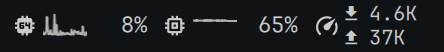
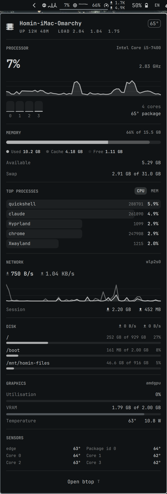

<h1 align="center">Ostat Menus</h1>

<p align="center">
  A system monitor for the <a href="https://omarchy.org">Omarchy</a> bar —
  live readout up top, the whole machine one click away.
</p>

<p align="center">
  
</p>

<p align="center">
  
</p>

<p align="center">
  <a href="#install">Install</a> ·
  <a href="#the-bar">The bar</a> ·
  <a href="#settings">Settings</a> ·
  <a href="#how-it-samples">How it samples</a> ·
  <a href="#what-it-can-read">What it can read</a>
</p>

---

CPU history and per-core load, memory composition, the top of the process
table, network and disk throughput, GPU utilisation, and every temperature the
machine reports — in one panel that follows your Omarchy theme.

Everything comes from `/proc` and `/sys`. No `psutil`, no `lm_sensors`, no
network, and no subprocess per sample: one small Python process streams the
numbers for the life of the widget.

## Install

```bash
omarchy plugin add https://github.com/hominluo/omarchy-ostat-menus.git --enable
omarchy bar move io.github.hominluo.ostat-menus --after omarchy.tray
```

Requires Omarchy with the Quickshell bar, and `python3` (already on every Arch
install). Nothing else.

To remove it:

```bash
omarchy plugin remove io.github.hominluo.ostat-menus
```

## The bar

Each configured metric gets a cell. Percentages (`cpu`, `mem`, `gpu`) render as
an icon, an optional micro-sparkline and a number; throughput (`net`, `disk`)
renders as a two-line down/up stack, which is the only way both directions fit
in a 26px bar.

| Interaction | Result |
|---|---|
| left click | open the panel |
| right click | jump straight to `btop` |
| hover | CPU / memory tooltip |

Inside the panel:

| Key | Result |
|---|---|
| `c` / `m` | sort the process table by CPU or by memory |
| `t` / `Enter` | open `btop` |
| `↑` `↓` / `j` `k` | scroll |
| `Tab` | move to the next bar panel |
| `Esc` | close |

## Settings

Set these on the widget's entry in `~/.config/omarchy/shell.json`, or with
`omarchy bar set`:

| Key | Default | What it does |
|---|---|---|
| `items` | `["cpu","mem","net"]` | which metrics the bar shows, in order: `cpu`, `mem`, `net`, `disk`, `gpu`, `temp` |
| `graph` | `true` | draw the micro-sparklines in the bar |
| `interval` | `2` | seconds between samples while the panel is closed |
| `activeInterval` | `1` | seconds between samples while the panel is open |
| `historySize` | `60` | samples kept, i.e. how far the graphs reach back |
| `monitorCommand` | `omarchy-launch-or-focus-tui btop` | what the footer button and right-click run |

Non-string values need `--json`:

```bash
omarchy bar set io.github.hominluo.ostat-menus items '["cpu","mem","gpu","net","disk"]' --json
omarchy bar set io.github.hominluo.ostat-menus graph false --json
omarchy bar set io.github.hominluo.ostat-menus monitorCommand "alacritty -e htop"
```

## How it samples

`sensors.py` runs for the life of the widget and prints one JSON object per
tick on stdout. The panel writes back on the same pipe:

```
interval <seconds>    change the sampling period
detail <0|1>          include the process table, mount usage and the full
                      temperature list, or skip them
```

`detail` is off while the panel is closed, so walking every `/proc/<pid>` only
happens when someone is looking at the result. That walk is the expensive part
of a tick — about 14ms against 1ms for everything else on a 300-process
machine — which is the whole reason for the switch.

Run it by hand to see the shape of a sample:

```bash
python3 sensors.py --once | jq
```

Two implementation notes worth knowing if you fork this:

- **Both settings go out in a single write.** Two `Process.write()` calls in one
  event-loop turn do not both reach the child; the second is silently dropped.
- **The sampler reads its own lines off the file descriptor.** A batched write
  can arrive as one chunk, and `select()` on a buffered `readline` then reports
  "nothing to read" while a complete second line sits in Python's buffer.

## What it can read

- **CPU, memory, swap, load, network, disk I/O, filesystem usage** — everywhere.
- **Temperatures and fans** — whatever `hwmon` exposes. A machine with no sensor
  drivers loaded simply has no SENSORS section.
- **GPU** — utilisation, VRAM, temperature and power come from the amdgpu sysfs
  interface. Intel and NVIDIA expose no equivalent `gpu_busy_percent`, so on
  those machines the GRAPHICS section hides itself and only the GPU temperature,
  if any, shows up under SENSORS.

A few numbers are computed rather than copied, and the definitions matter:

- **Process CPU is per-core**, the scale `top` and `btop` use: one fully busy
  thread reads 100% regardless of core count.
- **Memory "used" is `MemTotal - MemAvailable`** — the figure `free -h` calls
  used, not the resident-set sum, which double-counts shared pages. The three
  bands partition the total exactly: used, the reclaimable part of what is
  available, and the untouched remainder. `/proc/meminfo`'s own `Cached` is not
  used for the middle band because it already sits inside `MemAvailable`.
  "Free" is therefore `MemFree`, which on a warm machine is nearly nothing —
  the number you actually want is on the **Available** row.
- **Btrfs subvolumes and bind mounts collapse to one row per pool.** Listing
  `/`, `/home` and `/var/log` with three identical bars says nothing.

## Notes

- The bar instantiates one widget per monitor, so a multi-monitor setup runs one
  `sensors.py` per screen. At the default 2s idle interval that is a rounding
  error, but it is why the sampler is careful about what it does per tick.
- Plugins run unsandboxed inside `omarchy-shell`. This one reads `/proc` and
  `/sys`, opens no sockets, and spawns no processes other than the command
  behind the footer button. It is a few hundred lines — read them.

## Development

```bash
git clone https://github.com/hominluo/omarchy-ostat-menus.git \
  ~/.config/omarchy/plugins/io.github.hominluo.ostat-menus
omarchy-shell shell rescanPlugins
omarchy plugin enable io.github.hominluo.ostat-menus
```

Saving a file under `~/.config/omarchy/plugins/` hot-reloads the plugin, so
edits show up immediately. `omarchy plugin validate .` checks the manifest.

| File | What it is |
|---|---|
| `manifest.json` | plugin declaration and the settings schema |
| `sensors.py` | the sampler: `/proc` and `/sys` in, NDJSON out |
| `Panel.qml` | bar widget and popup panel |
| `Sparkline.qml` | history graph — area fill, stroked line, fixed time base |
| `MeterBar.qml` | single-value and segmented usage bars |
| `Model.js` | unit formatting and threshold helpers |

## License

MIT — see [LICENSE](LICENSE).

Not affiliated with Bjango or iStat Menus; the name is a nod, the code is not.

---

<p align="center">
  Built by <a href="https://x.com/hominluo">@hominluo</a>
</p>
